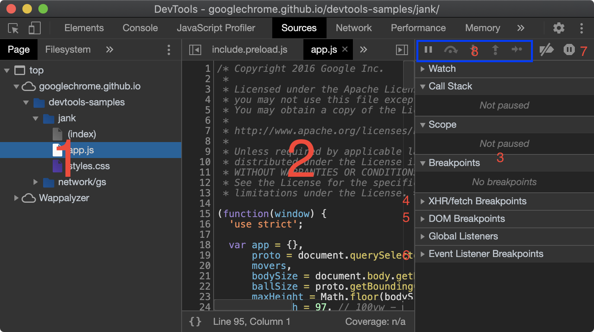
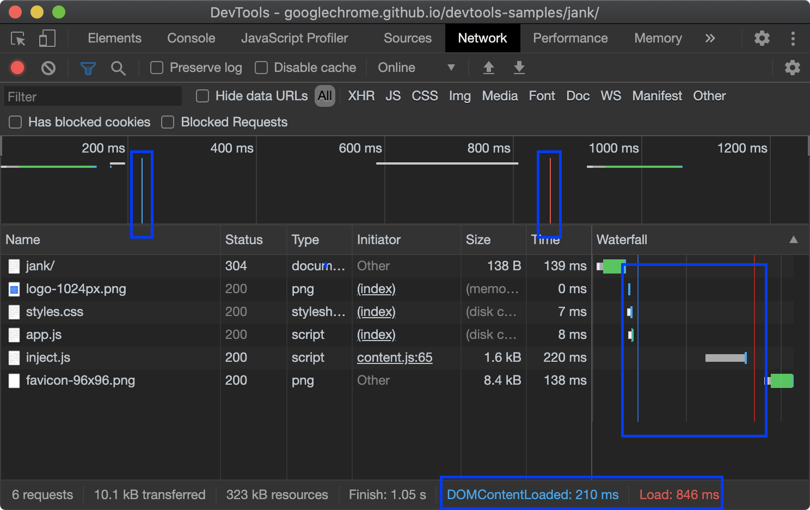
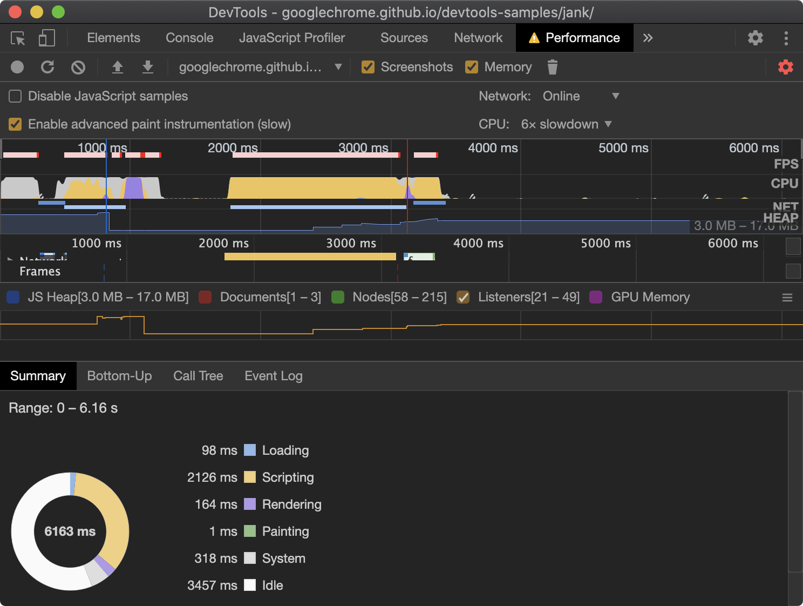

import Icon from '../components/icon'

## 常用快捷键

**DevTools：** `Cmd + Opt + I \ Ctrl + Shift + I`

**快捷指令：**`Cmd + Shift + P`

## 常用快捷指令
- **Show Rendering：** 调试dark模式、print预览、显示FRS的等
- **Show Animations：** 启用调试动画面板
- **Show Request blocking：** 启用需要禁止加载的文件
- **Show Coverage：** 启用代码覆盖率


## Elements panel

**节点引用`$0`和`temp1`**

- 在`Elements`面板选择的元素，或者右键检查的元素，可以通过`$0`在`Console`面板引用；`$0`引用的永远是最近一次的的选择。
- 在`Elements`面板选择元素，通过右键菜单选择`Store as global variable`，在`Console`面板生成`temp1`变量。
> `$0`为最新一次选择，`$1`为上一次，一直到`$4`；`temp`每一次自加 1。

**微调字体/布局大小**

-   `Option + Up`(Mac)/`Alt + Up`(Win) 递增 0.1
-   `Up` 递增 1，如果当前值在 -1 和 1 之间，则为 0.1
-   `Shift + Up` 递增 10
-   `Shift + Cmd + Up`(Mac)/`Shift + Page Up`(Win) 递增 100
> 递减也可以 up 更换为 down

## Console panel


1. 选择 JavaScript 执行环境；默认 top，可以选择其页面中的其他环境，如`iframe`环境

2. 实时表达式，可实时查看一个变量的值，或者一个表达式的结果。

### console 方法
- `console.time`：可查看一个函数的执行时间

     ```js
     console.time();
     for (var i = 0; i < 100000; i++) {
       let square = i ** 2;
     }
     console.timeEnd();
     ```

- `console.trace`：将堆栈跟踪信息打印到控制台。

    ```js
    const first = () => { second(); };
    const second = () => { third(); };
    const third = () => { fourth(); };
    const fourth = () => { console.trace(); };
    first();
    ```

- `console.count`：计数，每次调用计数加一，可用来查看for循环的执行次数

    ```js
    console.count(label)
    console.countReset(label);
    ```

**其他常用API**
- `$_`：最近求值表达式的值
- `$0 - $4`：最近选择的5个DOM元素
- `$(selector, [startNode]`：等效 `document.querySelector`
- `$$(selector, [startNode])`：等效 `document.querySelectorAll`
- `$x(path, [startNode]`： 匹配 xPath 表达式

## Sources panel



1. File Navigator 面板，有关页面的所有文件。
2. Code Editor 面板，在 File Navigator 面板选择文件后，在这里显示文件内容。
3. JavaScript Debugging 面板，这里可以调试 Code Editor 中的代码。

### 添加断点

DevTools中有多种断点方式

-   **行断点** Code Editor 中点击行号，这个最常用。
-   **条件断点** Code Editor 右键行号，编写表达式，当表达式为`true`时触发断点。
-   **DOM 断点** Elements 面板，选中元素，右键菜单，选择 Break on 出现三个选项。
    -   `subtree modifications`：子节点被添加/修改/删除时触发断点，当前节点不触发
    -   `attribute modifications`：在当前节点上添加/修改/删除属性时触发断点
    -   `node removal`：删除当前节点时触发断点

-   **XHR 断点** 如果要快速定位某条请求的在源码中的位置
    1. Source面板 -> Debugging -> 展开 XHR/fetch Breakpoints
    2. 点击添加断点
    3. 添加目标URL中的字符串。

-   **事件监听** 如果要快速找到事件监听的源码所在位置，如 load、鼠标、媒体查询等事件。
    1. Source面板 -> Debugging -> Event Listener Breakpoints
    2. 勾选相关事件

-   **异常断点**  如图所示`7`,蓝色表示开启，当有代码抛出错误时触发断点。
-   **debug()**  如果想要知道一个函数在哪里被调用，debug(函数名)，这个只能在 Console 面板调用。


### 进行调试

在图中`3` Debugging 面板观察和调试，在这里可以看到调用栈（Call Stack）和执行环境的变量（Scope）。
- **Scope**：调试中可修改变量的值
- **Watch**：调试时，实时观察一个变量的值，也可以输入一个表达式，查看实时结果
- **Call Stack**：查看函数的调用栈

### 跳过断点

图中`8`，依次向右
1. 执行代码，直到遇到下一个
2. 执行当前行，到下一行暂停
3. 遇到函数，可以进入函数内
4. 退出函数

> 也可以在 Code Editor 面版，选择需要暂停的代码上右键，选择 Continue to Here，代码会执行到此处中断执行。


## Network panel

`DOMContentLoaded` 和 `load` 事件



> 图中蓝色表示 DOMContentLoaded 事件，红色表示 load事件


## Performance panel

1. 开启隐身模式，避免干扰
2. 进入需要调试的网址 https://googlechrome.github.io/devtools-samples/jank/
3. Command+ Option+ I 打开 DevTools
4. Command + E 开始记录
5. 点击 Stop 停止记录



### 选择一部分 Overview 进行分析
在 Overview 中拖动鼠标，选中一部分，Frames、Main等 会显示选中的这一段的分析；可使用键盘或者鼠标进行缩放和移动。
-   **鼠标：**单击任何任一背景，左右移动，向上放大，向下缩小。
-   **键盘：**使用`W`、`A`、`S`、`D`，可缩放和移动。

> 想要在`Main`中查看很长的火焰图，可以用鼠标选中，向下移动查看。

### Overview

- **FPS：** 绿色越高表示`FPS`越高，绿色越高越好；上方的红色表示影响用户体验。
- **CPU：** 当`CPU`充满颜色时，说明此时`CPU`满负荷；如果长时间处于满负荷，可能时需要优化了。
- **Frames：** 鼠标划过，显示每一帧的`时间`和`FPS`的值

### 查看主线程活动
展开`Main`可查看火焰图，记录了主线程上发生了什么活动；x轴表示时间，y轴表示调用栈，上面的事件导致下面的事件。
通常黄色表示脚本活动，紫色表示渲染活动；如果只想看渲染活动，可在设置中选择`Disable JavaScript Samples`

**查看Main分析**

除了`Main`提供的火焰图，还可以通过底部提供的选项卡分析
-   Call Tree：当你想查看那个根活动产生了最多的事件
-   Bottom-Up：当你想查看哪一个事件花费的事件最长
-   Event Log：当你想按照事件顺讯查看活动时

**查看GPU活动**

**Network**

展开`Network`可查看网路请求的分析情况。

- HTML：蓝色
- CSS：紫色
- JS：黄色
- 图片：绿色

**查看请求**

点击选择一个请求查看：

坐上角的深蓝色表示该请求的优先级较高，如果是浅蓝色表示优先级较低
- 左行是Connection Start事件组之前的所有事件（包括事件）。换句话说，这是Request Sent排他性的一切。
- 条形图的浅色部分是Request Sent和Waiting (TTFB)。
- 条形图的深色部分是Content Download。
- 正确的选择实际上是等待主线程所花费的时间。在“ 时间”选项卡中未显示。

> 和 Network 面板相对应。


### 查看图层信息
1. 勾选 Enable advanced paint instrumentation(show)
2. 展开 Frames ，在底部选择 Layers 标签页
3. 也可以在 More tools 中选择 Layers


## JavaScript Profiler

1. 打开  JavaScript Profiles 面板
2. 点击 start
3. 根据分析内容重新加载页面或者和页面进行交互
4. 点击 stop

> 也可以在 Console 面板通过调用 `profile()`和`profileEnd()`录制，参考：[developers](https://developers.google.com/web/tools/chrome-devtools/console/utilities#profilename_and_profileendname)

**查看分析**
-   Overview：上面的折线图表示调用栈的深度，值越大表示越深。
-   Call Stacks：x轴是时间，y轴表示调用栈；

> y轴表示的调用栈深度可能不重要，但是在x轴上花费的时间很长的话，可能是需要优化了；
> 如果将鼠标放在某个调用栈上，最后一行显示 Not optimized，说明该功能存在潜在的优化。

---
参考：https://developers.google.com/web/tools/chrome-devtools

